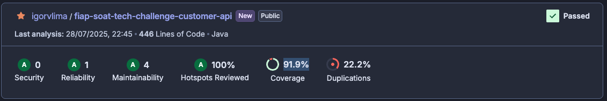

# Tech Challenge - Pós-Tech SOAT - FIAP

Este é o projeto desenvolvido durante a fase IV do curso de pós-graduação em Arquitetura de Software da FIAP - 2025.

Membro do grupo: Igor Veras Lima - RM360611

## Descrição

Este sistema é responsável por gerenciar a criação, consulta e desativação de usuários no ecossistema de um restaurante. Ele permite o cadastro de novos clientes, a busca por clientes existentes e a desativação de cadastros quando necessário.

## Arquitetura

O projeto segue a Arquitetura Hexagonal (Ports and Adapters), permitindo maior flexibilidade, testabilidade e facilidade de manutenção. Com isso, a aplicação desacopla regras de negócio de tecnologias específicas como frameworks, banco de dados ou interfaces externas.

## Criação de clientes e consultas

1. Criar um cliente

Para criar um cliente, faça uma requisição do tipo POST no endpoint `/customer`. O payload da requisição deve seguir o formato abaixo:

```json
{
  "cpf": "string",
  "price": 0,
  "name": "string",
  "email": "string"
}
```

2. Consulta de um cliente

Para consultar um cliente, faça uma requisição do tipo GET no endpoint `/customer/{id}`.

## Testes

O projeto possui uma cobertura de testes de 91.9%, conforme demonstrado abaixo:

